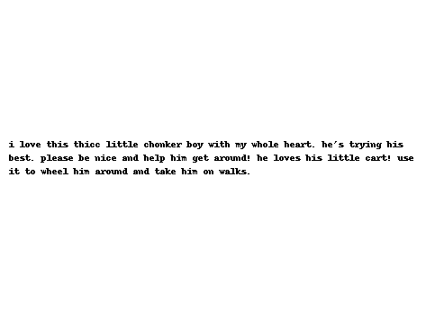

# Steganography Python Project


### Original Image // Encoded Image
 

These images may look identical, but one of them is encoded with a hidden message!

### Decoded Image


After running the encoded image through a short python script, this is the result!

---
### But how??
Every png can be broken down into pixels and every pixel contains 3 numbers that can range from 0 to 255. So a pixel looks something like this:

```(34, 0, 255)```

The first number represents red, the second is blue, and the third is green. 

My script looks through the red value of every pixel and makes that value even or odd depending on what color that pixel should be in the encoded message.

So a pixel with an odd red value will show up as a black pixel in the final result, and an even red value will be white.

This only changes the color very slightly! (207, x, x) and (206, x, x) aren't noticeably different! And many pixels will be completely unaffected if they already happen to be odd or even.


### How do I use steganography.py?
Run the interactive menu and you wont have to worry about any of the other commands!
- ```python3 steganography.py```

---
Encode image "abc.png" with "hello world"
- ```python3 steganography.py abc hello world```
- ```python3 steganography.py abc.png hello world```

Decode image ".png" in folder "img"*
- ```python3 steganography.py img/abc```
- ```python3 steganography.py img/abc.png```

Run the test which encodes and decodes images/chonker.png
- ```python3 steganography.py t```
- ```python3 steganography.py test```

*the folder img is in the same directory as steganography.py
